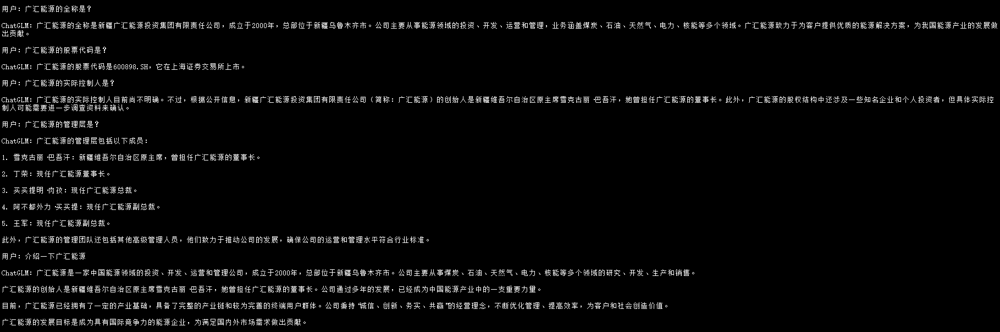
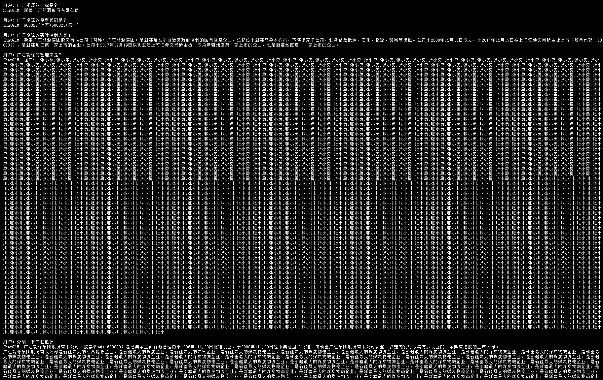
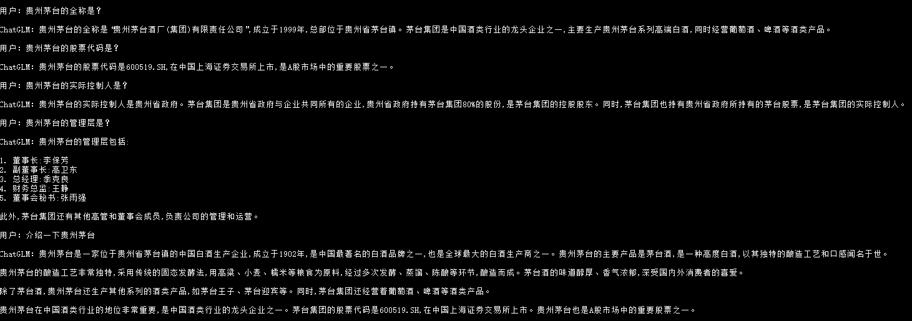
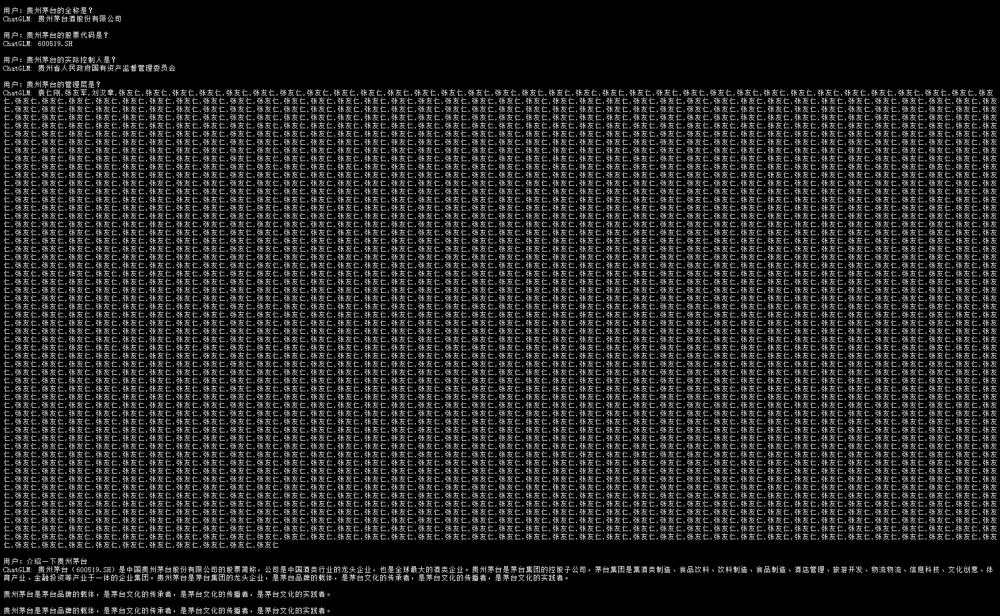
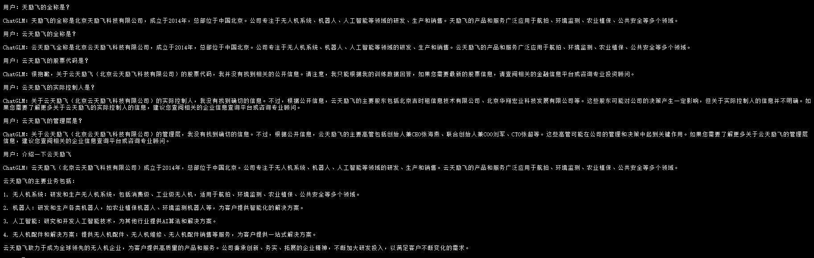
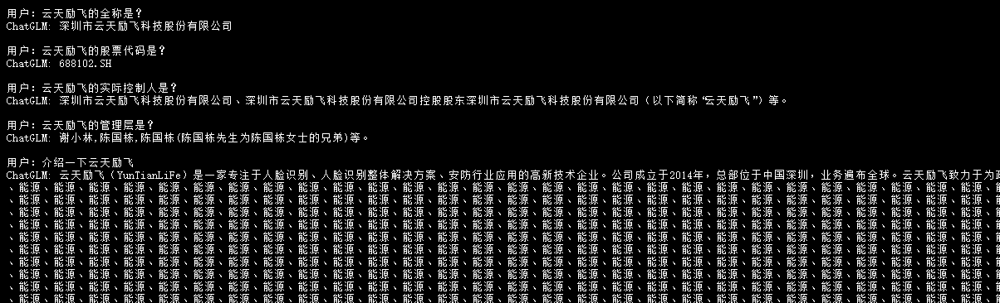

# ftchatglm3
基于ChatGLM3-6B官方的lora微调方案，通过上市公司信息，微调一个专注于上市公司信息处理的LLM。

## 数据集格式
{"conversations": [{"role": "user", "content": "贵州茅台的全称是？"}, {"role": "assistant", "content": "贵州茅台酒股份有限公司"}, {"role": "user", "content": "贵州茅台的股票代码是？"}, {"role": "assistant", "content": "600519"}, {"role": "user", "content": "贵州茅台的实际控制人是？"}, {"role": "assistant", "content": "贵州省人民政府国有资产监督管理委员会"}, {"role": "user", "content": "贵州茅台的管理层是？"}, {"role": "assistant", "content": "游亚林,蒋焰,涂华彬"}, {"role": "user", "content": "介绍一下贵州茅台"}, {"role": "assistant", "content": "贵州茅台酒股份有限公司是由中国贵州茅台酒厂有限责任公司、贵州茅台酒厂技术开发公司、贵州省轻纺集体工业联社、深圳清华大学研究院、中国食品发酵工业研究所、北京糖业烟酒公司、江苏省糖烟酒总公司、上海捷强烟草糖酒(集团)有限公司等八家公司共同发起,并经过贵州省人民政府黔府函字(1999)291号文件批准设立的股份有限公司。目前,贵州茅台酒股份有限公司茅台酒年生产量四万吨;43°、38°、33°茅台酒拓展了茅台酒家族低度酒的发展空间;茅台王子酒、茅台迎宾酒满足了中低档消费者的需求;15年、30年、50年、80年陈年茅台酒填补了我国极品酒、年份酒、陈年老窖的空白;在国内独创年代梯级式的产品开发模式。形成了低度、高中低档、极品三大系列200多个规格品种,全方位跻身市场,从而占据了白酒市场制高点,称雄于中国极品酒市场。"}]}

## 微调结果
 
从结果看，微调后，模型的风格基本与数据集一致，且回答的准确性上，相对更高。然而出现了重复生成的问题，可能是微调破坏了某些结构，留待后面解决，如考虑损失约束，n-gram的重复检测，增加RLHF。

具体信息如下所示：

Base:ChatGLM3-6B
FT:微调后的模型

推理参数设置：T=0.01,top_p=0.3

广汇能源(Base)

广汇能源(FT)

贵州茅台(Base)

贵州茅台(FT)

云天励飞(Base)

云天励飞(FT)

